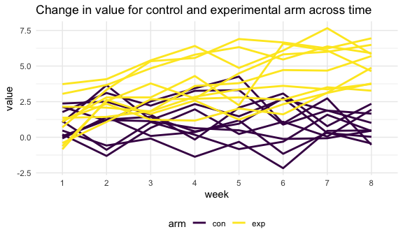

p8105\_hw5\_fl2569
================
Fang Liu
11/16/2021

``` r
library(tidyverse)

#figure size options
knitr::opts_chunk$set(
  fig.width = 6,
  fig.asp = .6,
  out.width = "90%"
)

#set theme settings
theme_set(theme_minimal() + theme(legend.position = "bottom"))

options(
  ggplot2.continuous.colour = "viridis",
  ggplot2.continuous.fill = "viridis"
)

scale_colour_discrete = scale_colour_viridis_d
scale_fill_discrete = scale_fill_viridis_d
```

## Problem 1

First, clean the data.

``` r
homicide_df = 
  read_csv("./data/homicide-data.csv", na = c("", "Unknown")) %>% 
  mutate(
    city_state = str_c(city, state),
    resolution = case_when(
      disposition == "Closed without arrest" ~ "unsolved",
      disposition == "Open/No arrest" ~ "unsolved",
      disposition == "Closed by arrest" ~ "solved"
    )) %>% 
  relocate(city_state) %>% 
  filter(city_state != "TulsaAL")
```

Focus on Baltimore, MD. The proportion of unsolved homicides is unsolved
homicides / total \# of homicides.

``` r
prop.test(x = 5, n = 10)
```

    ## 
    ##  1-sample proportions test without continuity correction
    ## 
    ## data:  5 out of 10, null probability 0.5
    ## X-squared = 0, df = 1, p-value = 1
    ## alternative hypothesis: true p is not equal to 0.5
    ## 95 percent confidence interval:
    ##  0.2365931 0.7634069
    ## sample estimates:
    ##   p 
    ## 0.5

``` r
baltimore_df = 
  homicide_df %>% 
  filter(city_state == "BaltimoreMD") #2827 total homicides

baltimore_summary = 
baltimore_df %>% 
  summarize(
    unsolved = sum(resolution == "unsolved"),#1825 unsolved homicides
    n = n()
)

baltimore_test = 
  prop.test(
    x = baltimore_summary %>% pull(unsolved),
    n = baltimore_summary %>% pull(n)
  ) #64% of the homicides in Baltimore is unsolved... 

baltimore_test %>% 
  broom::tidy()
```

    ## # A tibble: 1 x 8
    ##   estimate statistic  p.value parameter conf.low conf.high method    alternative
    ##      <dbl>     <dbl>    <dbl>     <int>    <dbl>     <dbl> <chr>     <chr>      
    ## 1    0.646      239. 6.46e-54         1    0.628     0.663 1-sample… two.sided

Let’s try iterate across all the cities! :)

First, write a function.

``` r
prop_test_function = function(city_df){
  
  city_summary = 
    city_df %>% 
    summarize(
      unsolved = sum(resolution == "unsolved"),#1825 unsolved homicides
      n = n()
    )

  city_test = 
    prop.test(
      x = city_summary %>% pull(unsolved),
      n = city_summary %>% pull(n)
    )
  #64% of the homicides in Baltimore is unsolved... 

  return(city_test) #city_test is a list of the prop.test results
}
```

Let’s test the function we just wrote.

``` r
prop_test_function(baltimore_df)
```

    ## 
    ##  1-sample proportions test with continuity correction
    ## 
    ## data:  city_summary %>% pull(unsolved) out of city_summary %>% pull(n), null probability 0.5
    ## X-squared = 239.01, df = 1, p-value < 2.2e-16
    ## alternative hypothesis: true p is not equal to 0.5
    ## 95 percent confidence interval:
    ##  0.6275625 0.6631599
    ## sample estimates:
    ##         p 
    ## 0.6455607

``` r
prop_test_function(
  homicide_df %>% 
    filter(city_state == "AlbuquerqueNM")
)
```

    ## 
    ##  1-sample proportions test with continuity correction
    ## 
    ## data:  city_summary %>% pull(unsolved) out of city_summary %>% pull(n), null probability 0.5
    ## X-squared = 19.114, df = 1, p-value = 1.232e-05
    ## alternative hypothesis: true p is not equal to 0.5
    ## 95 percent confidence interval:
    ##  0.3372604 0.4375766
    ## sample estimates:
    ##         p 
    ## 0.3862434

``` r
#OR
homicide_df %>% 
  filter(city_state == "AlbuquerqueNM") %>% 
  prop_test_function()
```

    ## 
    ##  1-sample proportions test with continuity correction
    ## 
    ## data:  city_summary %>% pull(unsolved) out of city_summary %>% pull(n), null probability 0.5
    ## X-squared = 19.114, df = 1, p-value = 1.232e-05
    ## alternative hypothesis: true p is not equal to 0.5
    ## 95 percent confidence interval:
    ##  0.3372604 0.4375766
    ## sample estimates:
    ##         p 
    ## 0.3862434

Now, let’s iterate across ALL cities.

``` r
nested_df = 
  homicide_df %>% 
  nest(data = uid:resolution) %>%  #create nested listed
  mutate(
    test_results = map(data, prop_test_function),
    tidy_results = map(test_results, broom::tidy)
  )

#test
nested_df %>% 
  filter(city_state == "BaltimoreMD") %>% 
  pull(tidy_results)
```

    ## [[1]]
    ## # A tibble: 1 x 8
    ##   estimate statistic  p.value parameter conf.low conf.high method    alternative
    ##      <dbl>     <dbl>    <dbl>     <int>    <dbl>     <dbl> <chr>     <chr>      
    ## 1    0.646      239. 6.46e-54         1    0.628     0.663 1-sample… two.sided

``` r
results_df = 
  homicide_df %>% 
  nest(data = uid:resolution) %>%  #create nested listed
  mutate(
    test_results = map(data, prop_test_function),
    tidy_results = map(test_results, broom::tidy)
  ) %>% 
  select(city_state, tidy_results) %>% 
  unnest(tidy_results) %>% 
  select(city_state, estimate, starts_with("conf")) %>% 
  arrange(estimate) #order from least unsolved homicide to highest unsolved homicide
```

Try make a plot showing estimates and confidence intervals.

``` r
results_df %>% 
  mutate(city_state = fct_reorder(city_state, estimate)) %>% 
  ggplot(aes(x = city_state, y = estimate)) +
  geom_point() +
  geom_errorbar(aes(ymin = conf.low, ymax = conf.high)) +
  theme(axis.text.x = element_text(angle = 90, vjust = 0.5, hjust = 1))
```


Another way of solving the problem using `map2`:

``` r
homicide_df %>% 
  group_by(city_state) %>% 
  summarize(
    unsolved = sum(resolution == "unsolved"),
    n = n()
  ) %>% 
  mutate(
    test_results = map2(unsolved, n, prop.test),
    tidy_results = map(test_results, broom::tidy)
  ) %>% 
  select(city_state, tidy_results) %>% 
  unnest(tidy_results) %>% 
  select(city_state, estimate, starts_with("conf"))
```

    ## # A tibble: 50 x 4
    ##    city_state    estimate conf.low conf.high
    ##    <chr>            <dbl>    <dbl>     <dbl>
    ##  1 AlbuquerqueNM    0.386    0.337     0.438
    ##  2 AtlantaGA        0.383    0.353     0.415
    ##  3 BaltimoreMD      0.646    0.628     0.663
    ##  4 Baton RougeLA    0.462    0.414     0.511
    ##  5 BirminghamAL     0.434    0.399     0.469
    ##  6 BostonMA         0.505    0.465     0.545
    ##  7 BuffaloNY        0.612    0.569     0.654
    ##  8 CharlotteNC      0.300    0.266     0.336
    ##  9 ChicagoIL        0.736    0.724     0.747
    ## 10 CincinnatiOH     0.445    0.408     0.483
    ## # … with 40 more rows

## Problem 2

-   Start with a data frame containing all file names (the `list.files`
    function will help)
-   Iterate over file names and read in data for each subject using
    `purrr::map` and saving the result as a new variable in the data
    frame
-   Tidy the result; manipulate file names to include control arm and
    subject ID, make sure weekly observations are “tidy”, and do any
    other tidying that’s necessary
-   Make a spaghetti plot showing observations on each subject over
    time, and comment on differences between groups

``` r
complete_data =
  tibble(
    files = list.files("./data/zip_data")
  ) %>% 
  mutate(
    data = map(str_c("./data/zip_data/", files), read_csv)
  ) %>% 
  unnest(data) %>%
  mutate(
    arm = substr(files,1, 3),
    subject_id = substr(files, 1, 6)
  ) %>% 
  select(arm, subject_id, everything(), -files) %>% 
  pivot_longer(
    week_1:week_8,
    names_to = "week",
    names_prefix = "week_",
    values_to = "value"
  )

complete_data %>% 
  ggplot(aes(x = week, y = value, group = subject_id, colour = arm)) +
  geom_line(size = 1) + 
  ggtitle("Change in value for control and experimental arm across time")
```


Participants in the experimental arm seems to be improving (assuming
that a higher value implies better patient outcome), while those in the
control arms didn’t improve or even showed signs of deterioration.

## Problem 3

There are two cases to address: \* For numeric variables, you should
fill in missing values with the **mean** of non-missing values. \* For
character variables, you should fill in missing values with
**virginica**.

First, load the iris data set from the tidyverse package and introduces
some missing values in each column.

``` r
set.seed(10)

iris_with_missing = iris %>% 
  map_df(~replace(.x, sample(1:150, 20), NA)) %>%
  mutate(Species = as.character(Species))
```

Write a function that takes a vector as an argument, replaces missing
values using the rules above, and returns the resulting vector.

``` r
fill_in_missing = function(input_vector){
  if (is.numeric(input_vector)) {
    input_vector[is.na(input_vector)] <- round(
      mean(input_vector, na.rm = TRUE),1)
  } else if (is.character(input_vector)) {
    input_vector[is.na(input_vector)] <- "virginica"
  }
  
  return(input_vector)
}
```

Apply this function to the columns of iris\_with\_missing using a map
statement.

``` r
iris_filled = as.data.frame(map(iris_with_missing, fill_in_missing))
iris_filled
```

    ##     Sepal.Length Sepal.Width Petal.Length Petal.Width    Species
    ## 1            5.1         3.5          1.4         0.2     setosa
    ## 2            4.9         3.0          1.4         0.2     setosa
    ## 3            4.7         3.2          1.3         0.2     setosa
    ## 4            4.6         3.1          1.5         1.2     setosa
    ## 5            5.0         3.6          1.4         0.2     setosa
    ## 6            5.4         3.9          1.7         0.4     setosa
    ## 7            5.8         3.4          1.4         0.3     setosa
    ## 8            5.0         3.4          1.5         0.2     setosa
    ## 9            4.4         2.9          1.4         0.2     setosa
    ## 10           4.9         3.1          3.8         0.1     setosa
    ## 11           5.4         3.1          1.5         0.2     setosa
    ## 12           4.8         3.4          1.6         0.2     setosa
    ## 13           5.8         3.1          1.4         0.1     setosa
    ## 14           4.3         3.0          3.8         0.1     setosa
    ## 15           5.8         4.0          3.8         0.2     setosa
    ## 16           5.7         4.4          1.5         0.4     setosa
    ## 17           5.4         3.9          1.3         0.4     setosa
    ## 18           5.1         3.5          1.4         1.2     setosa
    ## 19           5.7         3.8          1.7         0.3     setosa
    ## 20           5.1         3.8          1.5         1.2     setosa
    ## 21           5.4         3.4          1.7         0.2     setosa
    ## 22           5.1         3.7          1.5         0.4  virginica
    ## 23           4.6         3.6          1.0         0.2     setosa
    ## 24           5.8         3.3          3.8         0.5     setosa
    ## 25           4.8         3.4          1.9         0.2  virginica
    ## 26           5.0         3.0          3.8         0.2     setosa
    ## 27           5.0         3.4          1.6         0.4  virginica
    ## 28           5.2         3.5          1.5         0.2     setosa
    ## 29           5.8         3.4          1.4         0.2     setosa
    ## 30           4.7         3.2          1.6         0.2     setosa
    ## 31           4.8         3.1          3.8         0.2     setosa
    ## 32           5.4         3.1          1.5         0.4     setosa
    ## 33           5.2         3.1          1.5         0.1     setosa
    ## 34           5.5         4.2          1.4         0.2     setosa
    ## 35           4.9         3.1          3.8         0.2     setosa
    ## 36           5.0         3.2          1.2         0.2     setosa
    ## 37           5.5         3.5          1.3         0.2     setosa
    ## 38           4.9         3.6          1.4         0.1     setosa
    ## 39           4.4         3.0          1.3         1.2     setosa
    ## 40           5.1         3.4          1.5         0.2     setosa
    ## 41           5.0         3.5          1.3         0.3     setosa
    ## 42           4.5         3.1          1.3         1.2  virginica
    ## 43           4.4         3.2          1.3         0.2     setosa
    ## 44           5.0         3.5          1.6         0.6     setosa
    ## 45           5.1         3.8          1.9         0.4     setosa
    ## 46           4.8         3.0          1.4         0.3  virginica
    ## 47           5.1         3.8          1.6         0.2     setosa
    ## 48           4.6         3.2          3.8         0.2     setosa
    ## 49           5.3         3.7          1.5         0.2     setosa
    ## 50           5.0         3.1          1.4         0.2     setosa
    ## 51           7.0         3.1          4.7         1.4  virginica
    ## 52           6.4         3.2          4.5         1.5 versicolor
    ## 53           6.9         3.1          4.9         1.5 versicolor
    ## 54           5.5         2.3          4.0         1.3 versicolor
    ## 55           6.5         2.8          4.6         1.5 versicolor
    ## 56           5.7         2.8          4.5         1.3 versicolor
    ## 57           6.3         3.3          4.7         1.6  virginica
    ## 58           4.9         2.4          3.8         1.0 versicolor
    ## 59           6.6         2.9          4.6         1.3  virginica
    ## 60           5.2         2.7          3.9         1.4 versicolor
    ## 61           5.0         2.0          3.8         1.0 versicolor
    ## 62           5.9         3.0          4.2         1.5 versicolor
    ## 63           6.0         2.2          4.0         1.2 versicolor
    ## 64           6.1         2.9          4.7         1.4 versicolor
    ## 65           5.6         2.9          3.6         1.3 versicolor
    ## 66           6.7         3.1          4.4         1.4 versicolor
    ## 67           5.6         3.0          4.5         1.5 versicolor
    ## 68           5.8         3.1          4.1         1.0 versicolor
    ## 69           6.2         2.2          4.5         1.5 versicolor
    ## 70           5.6         2.5          3.9         1.1 versicolor
    ## 71           5.9         3.2          4.8         1.8 versicolor
    ## 72           5.8         2.8          4.0         1.3  virginica
    ## 73           6.3         2.5          4.9         1.5 versicolor
    ## 74           5.8         2.8          3.8         1.2 versicolor
    ## 75           6.4         2.9          4.3         1.3 versicolor
    ## 76           6.6         3.0          4.4         1.4 versicolor
    ## 77           6.8         2.8          4.8         1.4 versicolor
    ## 78           6.7         3.1          5.0         1.2 versicolor
    ## 79           6.0         3.1          4.5         1.2 versicolor
    ## 80           5.7         2.6          3.5         1.0  virginica
    ## 81           5.5         2.4          3.8         1.1 versicolor
    ## 82           5.8         2.4          3.7         1.0 versicolor
    ## 83           5.8         2.7          3.9         1.2 versicolor
    ## 84           6.0         2.7          5.1         1.6 versicolor
    ## 85           5.4         3.0          4.5         1.5 versicolor
    ## 86           5.8         3.4          4.5         1.6 versicolor
    ## 87           6.7         3.1          4.7         1.2 versicolor
    ## 88           5.8         3.1          4.4         1.3 versicolor
    ## 89           5.6         3.0          3.8         1.2 versicolor
    ## 90           5.5         2.5          4.0         1.2 versicolor
    ## 91           5.5         3.1          4.4         1.2 versicolor
    ## 92           5.8         3.1          4.6         1.2 versicolor
    ## 93           5.8         3.1          4.0         1.2 versicolor
    ## 94           5.0         2.3          3.3         1.2  virginica
    ## 95           5.8         2.7          4.2         1.3 versicolor
    ## 96           5.7         3.0          4.2         1.2 versicolor
    ## 97           5.7         2.9          4.2         1.3 versicolor
    ## 98           6.2         2.9          4.3         1.3 versicolor
    ## 99           5.1         2.5          3.0         1.2 versicolor
    ## 100          5.7         2.8          4.1         1.3  virginica
    ## 101          6.3         3.1          3.8         2.5  virginica
    ## 102          5.8         2.7          5.1         1.9  virginica
    ## 103          7.1         3.0          5.9         2.1  virginica
    ## 104          6.3         2.9          5.6         1.8  virginica
    ## 105          6.5         3.1          5.8         2.2  virginica
    ## 106          7.6         3.0          6.6         2.1  virginica
    ## 107          4.9         2.5          4.5         1.7  virginica
    ## 108          7.3         2.9          6.3         1.8  virginica
    ## 109          6.7         3.1          3.8         1.8  virginica
    ## 110          5.8         3.6          3.8         2.5  virginica
    ## 111          6.5         3.2          5.1         2.0  virginica
    ## 112          5.8         2.7          5.3         1.9  virginica
    ## 113          6.8         3.0          5.5         2.1  virginica
    ## 114          5.7         3.1          5.0         2.0  virginica
    ## 115          5.8         2.8          5.1         2.4  virginica
    ## 116          6.4         3.2          5.3         2.3  virginica
    ## 117          6.5         3.0          3.8         1.8  virginica
    ## 118          7.7         3.8          6.7         1.2  virginica
    ## 119          7.7         2.6          6.9         2.3  virginica
    ## 120          6.0         2.2          5.0         1.5  virginica
    ## 121          5.8         3.2          5.7         1.2  virginica
    ## 122          5.6         3.1          4.9         2.0  virginica
    ## 123          7.7         2.8          6.7         2.0  virginica
    ## 124          6.3         2.7          4.9         1.8  virginica
    ## 125          6.7         3.3          5.7         2.1  virginica
    ## 126          7.2         3.2          6.0         1.8  virginica
    ## 127          6.2         2.8          4.8         1.8  virginica
    ## 128          6.1         3.0          4.9         1.8  virginica
    ## 129          6.4         2.8          5.6         2.1  virginica
    ## 130          7.2         3.0          5.8         1.6  virginica
    ## 131          7.4         2.8          6.1         1.2  virginica
    ## 132          7.9         3.8          3.8         2.0  virginica
    ## 133          6.4         2.8          3.8         2.2  virginica
    ## 134          5.8         2.8          5.1         1.5  virginica
    ## 135          6.1         3.1          5.6         1.4  virginica
    ## 136          5.8         3.0          6.1         2.3  virginica
    ## 137          5.8         3.4          5.6         1.2  virginica
    ## 138          6.4         3.1          5.5         1.2  virginica
    ## 139          6.0         3.0          4.8         1.8  virginica
    ## 140          6.9         3.1          5.4         2.1  virginica
    ## 141          6.7         3.1          5.6         2.4  virginica
    ## 142          6.9         3.1          5.1         2.3  virginica
    ## 143          5.8         2.7          5.1         1.9  virginica
    ## 144          6.8         3.2          3.8         2.3  virginica
    ## 145          6.7         3.3          3.8         2.5  virginica
    ## 146          6.7         3.0          5.2         2.3  virginica
    ## 147          6.3         2.5          5.0         1.9  virginica
    ## 148          6.5         3.0          5.2         2.0  virginica
    ## 149          5.8         3.4          5.4         2.3  virginica
    ## 150          5.9         3.0          5.1         1.8  virginica
